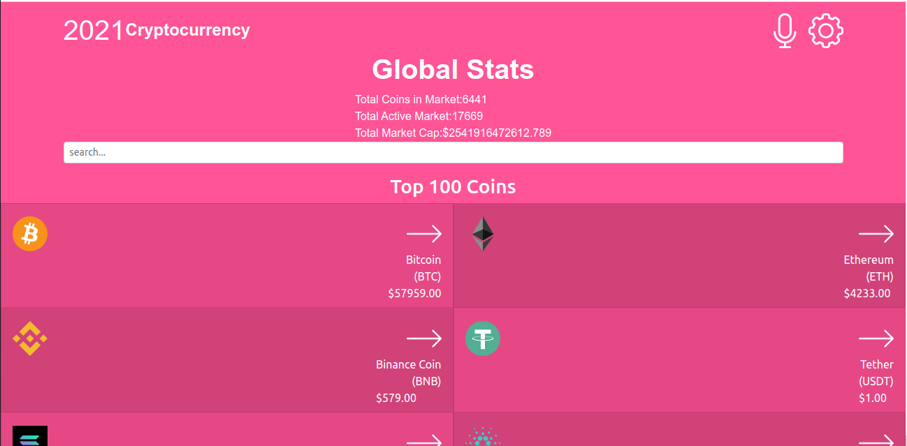

# Crypto Metrics

This is a mobile web app that provides simple information about data in the cryptocurrency market. Users can see the current price of any available cryptocurrency, can see the market cap of any cryptocurrency coin, and also filter the data based on the users' search.
  

## Live demo
[CryptoMetrics](https://crypto-metrics-d.netlify.app)

## Demo Video
[Loom Video](https://www.loom.com/share/99c6763445ea456ba96a078965ace87c)

## Built With

- React

- CSS

- Boostrap

- Visual Studio Code

- Git & Github

## Getting Started
To get a local copy up and running follow these simple example steps.

### Setup
* Open terminal
* Clone this project by command git clone(https://github.com/peterdgreat/Crypto-Metrics.git)
* Cd Crypto-Metrics

### install
Run the following command to have all npm packages dependencies installed:

npm install

### Usage

To start the webpack-dev-server, run the following command:

npm run start

## Authors

👤 **Ajayi Peter**

- GitHub: [@peterdgreat](https://github.com/peterdgreat)
- Twitter: [@dev_Peter_0](https://twitter.com/dev_Peter_O)
- LinkedIn: [ajayi-peter](https://linkedin.com/in/ajayi-peter-4391ab1b5)

## Show your support

Give a ⭐️ if you like this project!

## Acknowledgments
- Hat tip to anyone whose code was used
- Inspiration
- etc

# Credits
Credits: Nelson Sakwa

License: Nelson Sakwa
